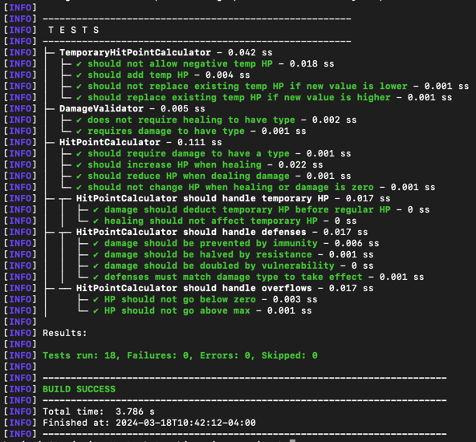

# D&D Beyond Character Service
Manage hit points and damage for Dungeons and Dragons characters.

# Project Description
The purpose of this project is to showcase my technical skills for the D&D Beyond back-end developer coding challenge.

The service is built so that additional character-related functionality can easily be added, but at the moment the main focus is on hit points and damage.

Technical highlights include:
- Low code duplication
  - Healing and damage using the same function in the service layer
  - Immunity, resistance, and vulnerability are elegantly handled with enums
- Testable code
  - Business logic is extracted into separate classes
- High quality tests
  - Tests go beyond basic coverage and are based on use cases
  - Tests output is organized, formatted, and nested to be human-readable

# Requirements
## Java
This project was built using Java 21.0.2 and has not been tested on earlier versions. 

You can check if it's installed and added to your PATH with `java --version`

```
java 21.0.2 2024-01-16 LTS
Java(TM) SE Runtime Environment (build 21.0.2+13-LTS-58)
Java HotSpot(TM) 64-Bit Server VM (build 21.0.2+13-LTS-58, mixed mode, sharing)
```

[Download](https://www.oracle.com/java/technologies/downloads) and [installation guide](https://docs.oracle.com/en/java/javase/21/install/overview-jdk-installation.html) from Oracle.

## Maven
This project was built using Maven 3.9.6 and has not been tested on earlier versions.

You can check if it's installed and added to your PATH with `mvn --version`

```
Apache Maven 3.9.6 (bc0240f3c744dd6b6ec2920b3cd08dcc295161ae)
Maven home: /Users/benjamin/infrastructure/apache-maven-3.9.6
Java version: 21.0.2, vendor: Oracle Corporation, runtime: /Library/Java/JavaVirtualMachines/jdk-21.jdk/Contents/Home
Default locale: en_US, platform encoding: UTF-8
OS name: "mac os x", version: "13.6.3", arch: "x86_64", family: "mac"
```

[Download](https://maven.apache.org/download.cgi) from Oracle.

Oracle does provide an [official installation guide](https://maven.apache.org/install.html), but I found the one from [Baeldung](https://www.baeldung.com/install-maven-on-windows-linux-mac) to be more helpful.

# Installation
1. Clone the repository
    ```bash
    git clone https://github.com/Benjamin-Carr/ddb-back-end-developer-challenge.git
    ```
2. Navigate to the `hit-point-service` directory
    ```bash
    cd ddb-back-end-developer-challenge/hit-point-service
    ```
3. Build the application
    ```bash
    mvn clean package
    ```
4. Start the application
    ```bash
    java -jar target/hit-point-service-0.0.1.jar server config.yml
    ```
5. Check that the application is running
    ```bash
    curl --location 'localhost:8080'
    ```
   Since that API is not defined should response with
    ```json
    {"code":404,"message":"HTTP 404 Not Found"}
    ```
   
# Tests
1. Navigate to the `hit-point-service` directory
2. Run the tests
    ```bash
    java -jar target/hit-point-service-0.0.1.jar server config.yml
    ```
The output will be organized, formatted, and nested to make it human-readable.



# Documentation


## API Endpoints

### Get All Characters


- **URL**: `/characters`

- **Method**: `GET`

- **Description**: Retrieves all player characters.


### Get Character by ID


- **URL**: `/characters/{id}`

- **Method**: `GET`

- **Description**: Retrieves the specified player character.

### Damage

- **URI**: `/characters/{id}/damage`
- **Method**: `POST`
- **Description**: Deals damage to the specified player character.
- **Request Body**:

  *amount must be negative*
  ```json
  {
    "damageType": "necrotic",
    "amount": -10
  }
  ```
  <details>
  <summary><b>Example curl</b></summary>

  ```bash
  curl --location 'localhost:8080/characters/briv/damage' \
  --header 'Content-Type: application/json' \
  --data '{
  "amount": -10,
  "damageType": "necrotic"
  }'
  ```
  </details>
  <details>
  <summary><b>Example response body</b></summary>
  <i>Assuming that briv had 25/25 HP</i>

  ```json
  {
      "code": 200,
      "message": "Hit points updated.",
      "data": {
          "maxHitPoints": 25,
          "tempHitPoints": 0,
          "tempHitPointsDelta": 0,
          "currentHitPoints": 15,
          "currentHitPointsDelta": -10,
          "multiplier": 1.0,
          "overflow": 0
      }
  }
  ```
  </details>
### Heal

- **URL**: `/characters/{id}/heal`
- **Method**: `POST`
- **Description**: Heals the specified player character.
- **Request Body**:

  *amount must be positive*
  ```json
  {
    "amount": 8
  }
  ```
    <details>
  <summary><b>Example curl</b></summary>

  ```bash
  curl --location 'localhost:8080/characters/briv/heal' \
  --header 'Content-Type: application/json' \
  --data '{
  "amount": 8
  }'
  ```
  </details>
  <details>
  <summary><b>Example response body</b></summary>
  <i>Assuming that briv had 15/25 HP</i>
  
  ```json
  {
      "code": 200,
      "message": "Hit points updated.",
      "data": {
          "maxHitPoints": 25,
          "tempHitPoints": 0,
          "tempHitPointsDelta": 0,
          "currentHitPoints": 23,
          "currentHitPointsDelta": 8,
          "multiplier": 1.0,
          "overflow": 0
      }
  }
  ```
</details>

### Add Temporary Hit Points

- **URL**: `/characters/{id}/temp-hp`
- **Method**: `POST`
- **Description**: Adds temporary hit points to the specified player character.
- **Request Body**:

  *amount must be positive*
  ```json
  {
    "amount": 5
  }
  ```
    <details>
  <summary><b>Example curl</b></summary>

  ```bash
  curl --location 'localhost:8080/characters/briv/temp-hp' \
  --header 'Content-Type: application/json' \
  --data '{
  "amount": 5
  }'
  ```
  </details>
  <details>
  <summary><b>Example response body</b></summary>
  <i>Assuming that briv had 23/25 HP and no temp HP</i>

  ```json
  {
      "code": 200,
      "message": "Hit points updated.",
      "data": {
          "maxHitPoints": 25,
          "tempHitPoints": 5,
          "tempHitPointsDelta": 5,
          "currentHitPoints": 23,
          "currentHitPointsDelta": 0,
          "multiplier": 1.0,
          "overflow": 0
      }
  }
  ```
</details>

### Remove Temporary Hit Points

- **URL**: `/characters/{id}/temp-hp`
- **Method**: `DELETE`
- **Description**: Removes all temporary hit points from the specified player character.
    <details>
  <summary><b>Example curl</b></summary>

  ```bash
  curl --location --request DELETE 'localhost:8080/characters/briv/temp-hp' \
  --header 'Content-Type: application/json'
  ```
  </details>
  <details>
  <summary><b>Example response body</b></summary>
  <i>Assuming that briv had 23/25 HP and 5 temp HP</i>

  ```json
  {
      "code": 200,
      "message": "Hit points updated.",
      "data": {
          "maxHitPoints": 25,
          "tempHitPoints": 0,
          "tempHitPointsDelta": -5,
          "currentHitPoints": 23,
          "currentHitPointsDelta": 0,
          "multiplier": 1.0,
          "overflow": 0
      }
  }
  ```
</details>